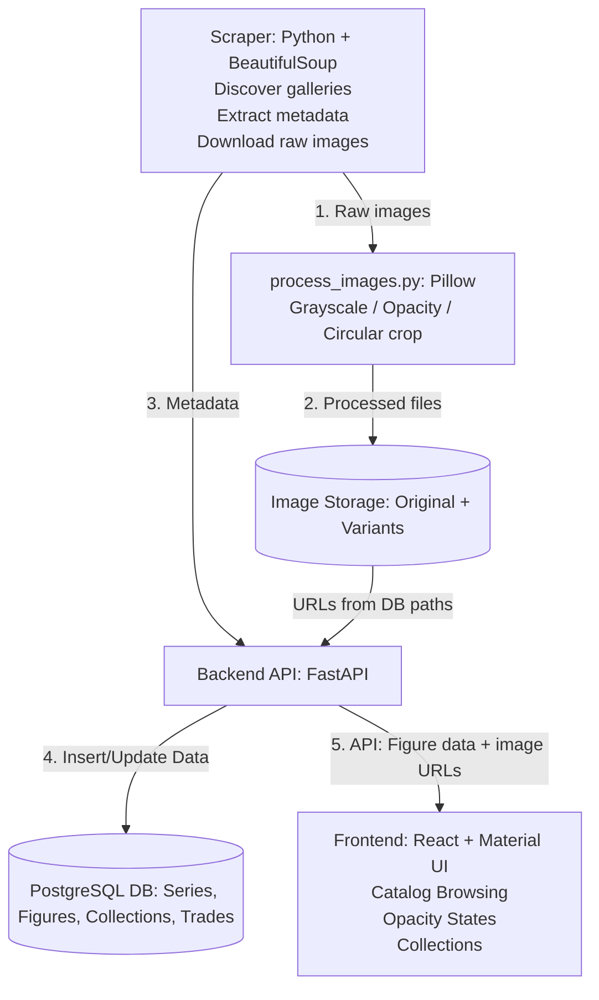

# Angel Archive
A platform for Sonny Angel collectors to **track, trade, and showcase** their collections — designed with a focus on community, personalization, and visual presentation.

## Table of Contents

- [Why Angel Archive Exists](#why-angel-archive-exists)
- [Technical Overview](#technical-overview)
- [Image Service (Optional)](#image-service-optional)
- [Data Pipeline (Scraper)](#data-pipeline-scraper)
- [Project Structure](#project-structure)
- [Testing](#testing)
- [Quick Start](#quick-start)
- [Architecture Diagram](#architecture-diagram)

---

## Why Angel Archive Exists
As a Sonny Angel collector, I noticed that most people were tracking their collections through:

- Google Sheets  
- Notes apps  
- Physical notebooks  
- Memory  

This led to:

- Disorganized collection tracking  
- Difficulty discovering new or rare figures  
- No central catalog of all figures  
- No easy way to showcase collections or trade with others  

**Angel Archive** solves these problems with a centralized, visual, collector-focused platform built specifically for the Sonny Angel community.

---

## Technical Overview
Angel Archive is built as a multi-service application with a focus on performance, maintainability, and a clean user experience.

### Backend — FastAPI
- Framework: **FastAPI**  
- Database: **PostgreSQL**  
- Authentication: JWT  
- Middleware: Rate limiting, audit logging  
- Scheduled tasks: APScheduler  

**Responsibilities:**
- Maintains a catalog of all figures and series with detailed metadata and images
- Tracks user-owned, in-search-of, and trade-list items  
- Handles trading and community interactions  
- Serves image URLs from storage; catalog data is populated by the scraper  

### Frontend — React + Material UI
- Framework: **React**  
- Component Library: **Material UI (MUI)**  
- Styling: MUI + CSS  
- Responsive UI with lazy-loaded images  

**Responsibilities:**
- Visual catalog browsing  
- Collection tracking  
- Showcase views  
- Applies dynamic opacity rules for owned/unowned figures  

---

## Image Service (Optional)
A separate FastAPI microservice in `image-service/` can generate image variants (opacity, grayscale, circular crop) via HTTP API. **The main app does not use it at runtime.** The frontend and backend serve pre-generated image URLs from the database and storage.

Image variants are produced by the **scraper** using `scraper/process_images.py` (Pillow) — grayscale, 50% opacity, and circular profile crops — then uploaded to storage and referenced in PostgreSQL. The image service provides the same transformations as an optional API for future or external use.

---

## Data Pipeline (Scraper)
A custom Python scraper populates and maintains the figure catalog. Run from the `scraper/` directory.

### Pipeline: Discover → Scrape → Process

| Step | Script | Output |
|------|--------|--------|
| **1. Discover** | `python discover_galleries.py` | `gallery_config.json` — series and gallery IDs from the official site |
| **2. Scrape** | `python scrape_images.py` | `images/{series_name}_Series/` — raw PNGs per series |
| **3. Process** | `python process_images.py` | `images_bw/`, `images_opacity/`, `images_profile_pic/` — grayscale, 50% opacity, circular crops |

After processing, upload the generated folders to storage and load figure metadata into PostgreSQL (via backend/DB tooling or scripts) so the app can serve catalog and image URLs.

**Responsibilities:**
- Discover official Sonny Angel galleries  
- Scrape figure metadata and images  
- Process images locally (grayscale, opacity, circular crop)  
- Upload processed images to storage and load metadata into PostgreSQL  

**Tech stack:** Python, Requests, BeautifulSoup4, Pillow, scheduled tasks.

---

## Project Structure
```
angel-archive/
├── backend/         # FastAPI backend
│ ├── app/           # API, models, routes, middleware
│ ├── database/      # SQL models + migrations
│ └── tests/         # Backend tests
├── frontend/        # React + Material UI
├── scraper/         # Scraping scripts
└── image-service/   # Optional: image processing API (scraper uses process_images.py instead)
```

## Testing

### Backend Tests
- API endpoint tests (pytest)  
- Database integration tests  
- Angel and image-URL endpoint tests  
- Middleware behavior (rate limiting, audit logs)  

**Run with:**
```bash
cd backend
pytest
```

### Frontend Tests
- **Vitest** + **React Testing Library** for unit/component tests  
- Custom render with MUI `ThemeProvider` and React Router in `src/test/utils.jsx`  
- Example tests: `components/Counter.test.jsx`, `components/SearchBar.test.jsx`  

**Run with:**
```bash
cd frontend
npm run test          # watch mode
npm run test:run      # single run
npm run test:coverage
```

## Quick Start

### 1. Clone the repository
```bash
git clone https://github.com/itsmeicode/angel-archive.git
cd angel-archive
```

### 2. Backend Setup
```bash
cd backend
python -m venv venv
source venv/bin/activate   # Windows: venv\Scripts\activate
pip install -r requirements.txt
uvicorn app.main:app --reload
```

### 3. Frontend Setup
```bash
cd frontend
npm install
npm run dev
```

### 4. Scraper (optional)
To populate the figure catalog: discover galleries, then scrape images, then process them (see [Data Pipeline](#data-pipeline-scraper)).

```bash
cd scraper
python -m venv venv
source venv/bin/activate   # Windows: venv\Scripts\activate
pip install -r requirements.txt
python discover_galleries.py   # 1. Discover → gallery_config.json
python scrape_images.py        # 2. Scrape → images/{series}/
python process_images.py       # 3. Process → images_bw/, images_opacity/, images_profile_pic/
```

## Architecture Diagram

