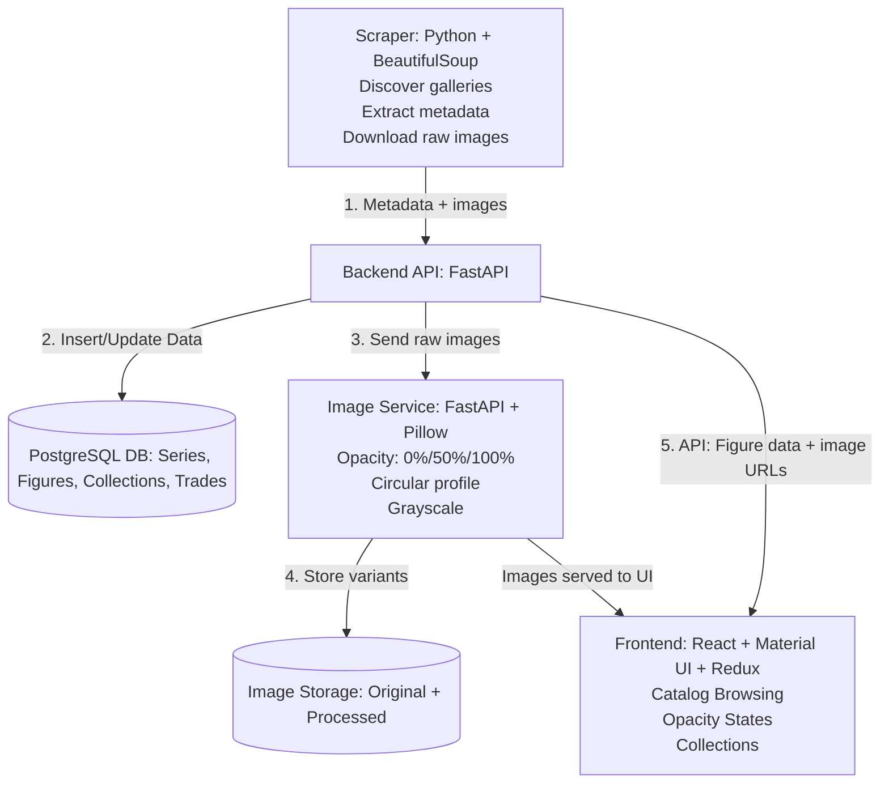

# Angel Archive
A platform for Sonny Angel collectors to **track, trade, and showcase** their collections — designed with a focus on community, personalization, and visual presentation.

## Table of Contents

- [Why Angel Archive Exists](#why-angel-archive-exists)
- [Technical Overview](#technical-overview)
- [Image Service (Dynamic Opacity & Profile Images)](#image-service-dynamic-opacity--profile-images)
- [Data Pipeline (Scraper)](#data-pipeline-scraper)
- [Project Structure](#project-structure)
- [Testing](#testing)
- [Quick Start](#quick-start)
- [Architecture Diagram](#architecture-diagram)

---

## Why Angel Archive Exists
As a Sonny Angel collector, I noticed that most people were tracking their collections through:

- Google Sheets  
- Notes apps  
- Physical notebooks  
- Memory  

This led to:

- Disorganized collection tracking  
- Difficulty discovering new or rare figures  
- No central catalog of all figures  
- No easy way to showcase collections or trade with others  

**Angel Archive** solves these problems with a centralized, visual, collector-focused platform built specifically for the Sonny Angel community.

---

## Technical Overview
Angel Archive is built as a multi-service application with a focus on performance, maintainability, and a clean user experience.

### Backend — FastAPI
- Framework: **FastAPI**  
- Database: **PostgreSQL**  
- Authentication: JWT  
- Middleware: Rate limiting, audit logging  
- Scheduled tasks: APScheduler  

**Responsibilities:**
- Maintains a catalog of all figures and series with detailed metadata and images
- Tracks user-owned, in-search-of, and trade-list items  
- Handles trading and community interactions  
- Coordinates with the scraper and image service  

### Frontend — React + Material UI
- Framework: **React**  
- Component Library: **Material UI (MUI)**  
- State Management: **Redux Toolkit**  
- Styling: MUI + CSS Modules  
- Responsive UI with lazy-loaded images  

**Responsibilities:**
- Visual catalog browsing  
- Collection tracking  
- Showcase views  
- Applies dynamic opacity rules for owned/unowned figures  

---

## Image Service (Dynamic Opacity & Profile Images)
The **Image Service** is a dedicated FastAPI microservice built to support Angel Archive’s **interactive collector UI**.

**Purpose:**  
Instead of storing multiple static versions of images, this service dynamically generates visual variants to reflect ownership and interaction:

- **100% opacity** → user owns the figure  
- **50% opacity (hover state)** → user does not own the figure but is interacting with it  
- **0% opacity** → user does not own the figure  
- **Circular crop** → profile pictures for users  

**Key Features:**
- Dynamic opacity adjustment based on ownership and interaction  
- Circular image generation for profile display  
- Optional grayscale variants for UI styling  
- Batch processing for multiple images or entire series  
- Memory-efficient streaming for fast delivery  

This ensures the UI always accurately reflects the user’s collection in real time.

---

## Data Pipeline (Scraper)
A custom Python scraper populates and maintains the figure catalog.

**Responsibilities:**
- Discover official Sonny Angel galleries  
- Scrape figure metadata and images  
- Send images to the image service for processing  
- Normalize and load data into PostgreSQL  

**Tech stack:** Python, Requests, BeautifulSoup4, scheduled tasks.

---

## Project Structure
```
angel-archive/
├── backend/         # FastAPI backend
│ ├── app/           # API, models, routes, middleware
│ ├── database/      # SQL models + migrations
│ └── tests/         # Backend tests
├── frontend/        # React + Material UI
├── scraper/         # Scraping scripts
└── image-service/   # Image processing microservice
```

## Testing

### Backend Tests
- API endpoint tests (pytest)  
- Database integration tests  
- Image processing validation  
- Middleware behavior (rate limiting, audit logs)  

**Run with:**
```bash
cd backend
pytest
```

### Frontend Tests
- Component tests (React Testing Library)  
- Integration tests (End-to-end)  
- Accessibility tests (a11y)  

**Run with:**
```bash
cd frontend
npm test
```

## Quick Start

### 1. Clone the repository
```bash
git clone https://github.com/itsmeicode/angel-archive.git
cd angel-archive
```

### 2. Backend Setup
```bash
cd backend
python -m venv venv
source venv/bin/activate   # Windows: venv\Scripts\activate
pip install -r requirements.txt
uvicorn app.main:app --reload
```

### 3. Frontend Setup
```bash
cd frontend
npm install
npm run dev
```

### 4. Image Service Setup
```bash
cd image-service
python -m venv venv
source venv/bin/activate   # Windows: venv\Scripts\activate
pip install -r requirements.txt
uvicorn main:app --reload
```

### 5. Scraper Setup
```bash
cd scraper
python -m venv venv
source venv/bin/activate   # Windows: venv\Scripts\activate
pip install -r requirements.txt
python discover_galleries.py
```

## Architecture Diagram

